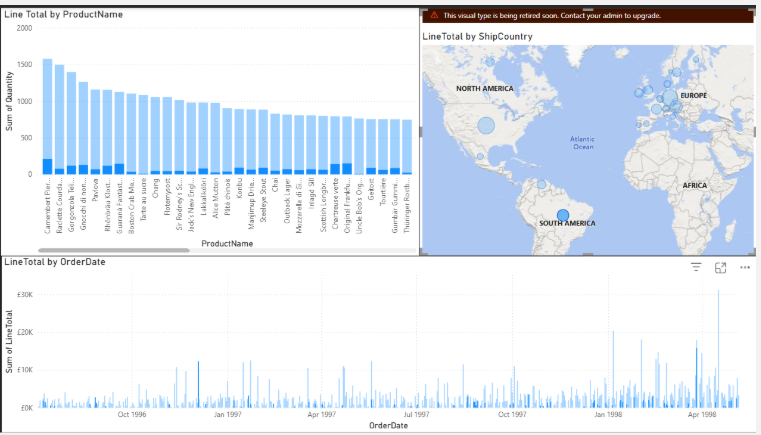
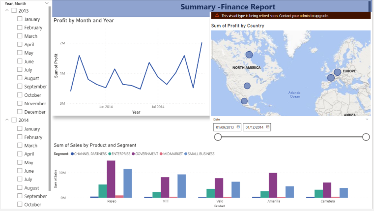
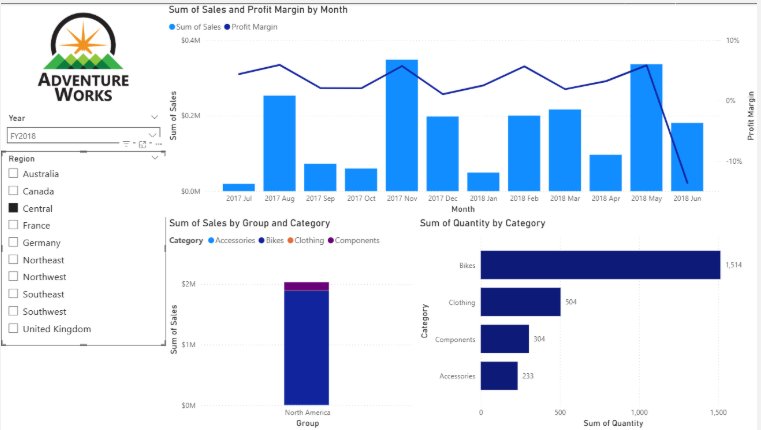

# Power BI Retail & Sales Dashboard Project

This project was completed as part of a **Data Technician Bootcamp** and focuses on analysing retail and sales data using **Microsoft Power BI**. The objective was to transform raw datasets into interactive reports that help explore business performance, identify trends, and support data-driven decision making.

The project demonstrates how Power BI can be used to **clean, transform, analyse, and visualise business data** through dynamic dashboards and interactive visualisations.

---

# Project Overview

Using retail and sales datasets, this project explores patterns in product performance, sales trends, and business metrics. The dashboards enable users to interact with the data through slicers and filters to uncover insights and explore different aspects of the dataset.

The reports combine multiple visualisations into cohesive dashboards that communicate key findings through **clear data storytelling**.

---

# Power BI Skills Demonstrated

This project demonstrates several core Power BI skills including:

- **Data transformation and cleaning using Power Query**
- Creating **interactive dashboards and reports**
- Using **slicers and filters** for dynamic data exploration
- Creating **DAX calculated columns and measures**
- Building a variety of visualisations including:
  - Bar charts
  - Line charts
  - Pie charts
  - Map visualisations
- Designing dashboards that support **data storytelling**
- Combining multiple visuals into a single analytical report

---

# Report Visualisations

## Sales Data Dashboard



This dashboard provides an overview of sales performance across products and categories. It highlights key sales metrics and allows users to explore trends within the dataset.

Key insights include:
- Sales performance by product category
- Comparison of sales metrics
- Overview of business performance indicators

---

## Finance Report Dashboard



This report focuses on financial performance metrics and provides visualisations that help analyse revenue patterns and financial trends within the dataset.

Key insights include:
- Financial performance indicators
- Revenue comparisons
- Business performance analysis

---

## Adventure Works Dashboard



This dashboard explores the Adventure Works dataset and demonstrates how Power BI can be used to analyse product performance and sales metrics.

Key insights include:
- Product performance comparisons
- Sales trends across categories
- Business performance analysis

---

# Dataset

The datasets used in this project include **retail and sales data** containing information such as product categories, quantities, pricing, and sales performance metrics.

The data was prepared and transformed using **Power Query** before being used to build the Power BI reports.

---

# Tools Used

- **Microsoft Power BI**
- **Power Query**
- **DAX (Data Analysis Expressions)**
- **Microsoft Excel**

---

# Repository Structure

```
My-PowerBI-Repository
│
├── Data_Technician_Workbook_Week_2_2026[1].docx
├── Sales Dataset.xlsx
├── 08-Starter-Sales Analysis.pbix
├── Sales-Data-Dashboard.png
├── Finance-Report-Dashboard.png
├── Adventur-Works-Dashboard.png
└── README.md
```

---

# Learning Outcomes

Through this project I developed practical skills in:

- Cleaning and transforming datasets using **Power Query**
- Creating **DAX calculations and measures**
- Designing **interactive Power BI dashboards**
- Visualising business and retail data effectively
- Communicating insights through **data storytelling and visual analytics**
